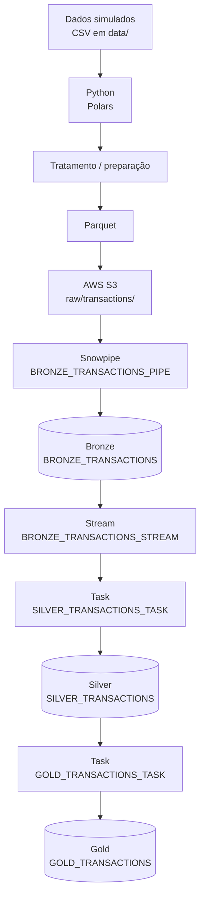
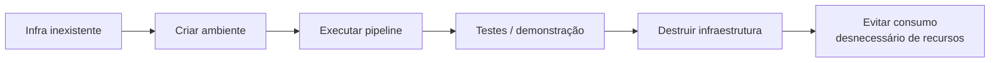

# 🛡️ Anti-Fraud Data Platform

Projeto **acadêmico** de engenharia de dados que demonstra um pipeline de transações de cartão com **Python + AWS S3 + Snowflake**, usando **arquitetura em camadas (Bronze → Silver → Gold)** e **processamento incremental** com Streams e Tasks.

> O foco principal está no pipeline dentro do **Snowflake**. A infraestrutura é criada, testada e destruída.

---

## 🔎 Arquitetura



| Etapa | Papel | Onde está no projeto |
|---|---|---|
| 🐍 **Python** | Lê os CSVs simulados e prepara os dados | `src/upload_transactions.py`, `src/convert_transactions.py` |
| 📦 **Parquet** | Formato colunar usado na ingestão | `convert_to_parquet()` (Polars) |
| ☁️ **AWS S3** | Armazena arquivos: `landing/transactions/` (CSV) e `raw/transactions/` (Parquet) | `infrastructure/main.tf` |
| 🔄 **Snowpipe** | Ingestão automática do S3 → Bronze via notificação S3 → SQS | `sql/5_create_pipe_bronze_transactions.sql`, `src/aws_s3.py` |
| 🥉 **Bronze** | Dados brutos ingeridos + metadados (`SOURCE_FILENAME`, `INGESTION_TS`) | `sql/2_create_bronze_transactions.sql` |
| 🌊 **Stream** | Detecta apenas os novos registros (append-only) → incremental | `sql/4_create_stream.sql` |
| ⚙️ **Tasks** | Automatizam o processamento a cada 1 min e em cadeia | `sql/6_...`, `sql/7_...` |
| 🥈 **Silver** | Dados tratados e tipados (ex.: `TRN_DT` como timestamp) | `sql/3_create_silver_transactions.sql` |
| 🥇 **Gold** | Agregações por banco/mês (aprovação, ticket médio, faturamento) | `sql/7_create_task_gold_transactions.sql` |

---

## ⚡ Filosofia: criar, testar e destruir



Por ser um projeto acadêmico, o ambiente é criado rapidamente para uma demonstração e removido logo em seguida. Terraform e os scripts Python cuidam disso.

**Criar** (Terraform + Snowflake + carga dos dados):

```bash
uv run src/main.py
```

**Destruir** (`terraform destroy` + `DROP DATABASE ANTI_FRAUD_DB`):

```bash
uv run src/destroy_infrastructure.py
```

**Pausar/retomar** o Pipe e as Tasks sem destruir tudo: `sql/9_suspend_pipe_tasks.sql` e `sql/8_resume_pipe_tasks.sql`.

> ⚠️ **Importante:** após finalizar os testes ou demonstrações, recomenda-se destruir os recursos criados para evitar consumo desnecessário de infraestrutura.

---

## ☁️ Configuração da AWS (AWS Academy)

O projeto usa credenciais temporárias do laboratório da AWS Academy.

1. Acesse o [AWS Academy Login](https://www.awsacademy.com/vforcesite/LMS_Login).
2. Faça login com suas credenciais.
3. Abra o laboratório AWS disponibilizado.
4. Inicie o laboratório, caso não esteja ativo.
5. Aguarde o ambiente AWS ficar disponível.
6. Abra as credenciais temporárias (AWS Details / CLI).
7. Copie as credenciais.
8. Cole no arquivo de credenciais local.

Arquivo: `~/.aws/credentials` (Windows: `C:\Users\<SEU_USUARIO>\.aws\credentials`)

```ini
[default]
aws_access_key_id = SUA_ACCESS_KEY
aws_secret_access_key = SUA_SECRET_KEY
aws_session_token = SEU_SESSION_TOKEN
```

O perfil `default` é lido por `src/aws_credentials.py` e injetado no stage do Snowflake (`sql/1_stage_s3_transactions.sql`).

> ⚠️ As credenciais da AWS Academy são **temporárias**. Se expirarem, inicie o laboratório novamente e atualize o arquivo de credenciais. Nunca coloque chaves reais no repositório.

---

## ❄️ Configuração do Snowflake

Crie um arquivo `.env` na raiz do projeto (não existe `.env.example` no repositório):

```env
SNOWFLAKE_USER=SEU_USUARIO
SNOWFLAKE_PASSWORD=SUA_SENHA
SNOWFLAKE_ACCOUNT=SEU_ACCOUNT_IDENTIFIER
```

A conexão (`src/snowflake_connection.py`) usa ainda, fixos no código: warehouse `LAB_WH` e role `ACCOUNTADMIN`.

> ⚠️ O arquivo `.env` contém informações sensíveis e **não deve ser enviado para o repositório** (já está no `.gitignore`).

---

## 🚀 Como executar

Pré-requisitos: Python 3.11, [uv](https://docs.astral.sh/uv/) e Terraform instalados.

```bash
# 1. instalar dependências
uv sync

# 2. criar infra + executar o pipeline
uv run src/main.py

# 3. destruir o ambiente após o uso
uv run src/destroy_infrastructure.py
```

No Windows há um atalho: basta executar `run.bat` (que roda `uv run .\src\main.py`).

Sequência recomendada:

1. Configurar credenciais AWS (`~/.aws/credentials`)
2. Configurar o `.env` do Snowflake
3. Instalar dependências com `uv sync`
4. Colocar os CSVs de transações (separador `;`) na pasta `data/`
5. Executar o pipeline: `uv run src/main.py`
6. Conferir as tabelas Bronze → Silver → Gold no Snowflake
7. Destruir o ambiente: `uv run src/destroy_infrastructure.py`

O que o `src/main.py` faz, em ordem:

```text
[1/4] terraform apply -auto-approve      → bucket e pastas no S3
[2/4] setup_snowflake()                  → SQL 0..5, notificação S3→SQS, SQL 6..8
[3/4] upload_transactions()              → CSVs para landing/transactions/
[4/4] process_transactions()             → CSV → Parquet → raw/transactions/
```

Testes:

```bash
uv run pytest
```

---

## 🧰 Tecnologias

🐍 Python · ☁️ AWS S3 · 🏗️ Terraform · ❄️ Snowflake · 📦 Parquet · 🔄 Snowpipe · 🌊 Streams · ⚙️ Tasks · 🔧 uv

---

## 📁 Estrutura

```text
├── src/                 # scripts do pipeline (main, upload, convert, execute_sql, destroy)
├── sql/                 # DDL e objetos Snowflake (0..9, executados em ordem)
├── infrastructure/      # Terraform (bucket S3 e prefixos)
├── tests/               # testes com pytest
└── run.bat              # atalho de execução no Windows
```
