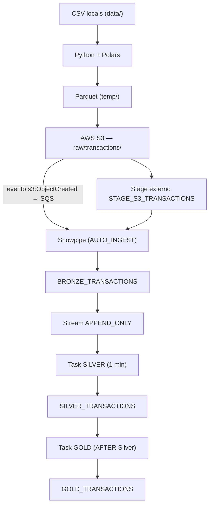

# Documentação Técnica — Pipeline de Dados Anti-Fraude

Projeto: `anti-fraud-data-plataform` — Todas as informações foram extraídas diretamente dos arquivos Python, SQL e Terraform do repositório.

## 1. Objetivo do projeto

O projeto implementa um pipeline de processamento de dados de transações de cartão para um cenário de prevenção a fraudes. Arquivos de transações são preparados em Python, convertidos para Parquet, enviados a um bucket AWS S3 e ingeridos automaticamente no Snowflake, onde percorrem uma arquitetura em camadas (Bronze → Silver → Gold) com processamento incremental via Stream e Tasks. O resultado final é uma tabela analítica agregada por banco e mês com volume, valor e taxa de aprovação das transações.

## 2. Tecnologias utilizadas

| Função | Tecnologia | Arquivos |
|---|---|---|
| Data Warehouse e pipeline | Snowflake (Stage, Snowpipe, Stream, Tasks) | `sql/0_*.sql` … `sql/9_*.sql` |
| Preparação dos dados | Python 3.11, Polars, PyArrow | `src/convert_transactions.py` |
| Armazenamento e eventos | AWS S3 e SQS (via boto3) | `src/upload_transactions.py`, `src/aws_s3.py` |
| Provisionamento | Terraform | `infrastructure/main.tf` |
| Orquestração | Python, Jinja2, snowflake-connector-python | `src/main.py`, `src/execute_sql.py` |

## 3. Arquitetura do pipeline



Fluxo resumido: `Origem CSV → Python → Parquet → S3 → Stage → Snowpipe → Bronze → Stream → Task → Silver → Task → Gold`.

O projeto também envia os CSVs originais para o prefixo `landing/transactions/` (`src/upload_transactions.py`), que funciona como área de aterrissagem do dado bruto e não é consumida pelo Snowpipe.

## 4. Preparação e conversão dos dados

Implementada em `src/convert_transactions.py`. A origem são todos os arquivos `*.csv` da pasta local `data/`, lidos com Polars usando separador `;`:

```python
df = pl.read_csv(file_path, separator=";",
                 schema_overrides={"TRANSACTION_ID": pl.String, ...})
```

O `schema_overrides` é a única conversão de tipos feita em Python: força 12 colunas de identificadores e códigos (`TRANSACTION_ID`, `BANK`, `CARD_NUMBER`, `AUTHORIZATION_CODE`, `ACQUIRER_ID`, `CURRENCY_CD`, `TRANSACTION_COUNTRY_CD`, `MERCHANT_ID`, `REASON_CODE`, `POS_NUMBER`, `MERCHANT_CATEGORY_CODE`, `PROCESS_CODE`) a serem lidas como texto, evitando que códigos com zeros à esquerda (ex.: `REASON_CODE = '000'`) sejam inferidos como número. As demais colunas seguem a inferência automática.

**Não foram identificados** no código tratamentos de valores nulos, deduplicação, filtros ou descarte de registros inválidos. O único mecanismo de resiliência é um `try/except` por arquivo, que registra o erro e segue para o próximo — o conteúdo dos arquivos válidos não é alterado.

Cada CSV é gravado como Parquet em `temp/` (`df.write_parquet`), enviado ao S3 com a chave `raw/transactions/<arquivo>.parquet` e o arquivo temporário é removido.

**Por que Parquet:** formato colunar, comprimido e com esquema embutido — reduz o volume armazenado e permite ao Snowflake ler os campos por nome (`$1:COLUNA`) no `COPY INTO`, sem file format textual nem risco de erro de delimitador ou de inferência de tipo.

## 5. Quantidade de arquivos e registros processados

**Não foi possível identificar no projeto.** A pasta `data/` consta do `.gitignore` e não existe no repositório — não há arquivos CSV nem Parquet versionados em nenhum commit do histórico. Portanto, quantidade de arquivos, total de registros e volume de dados **não foram identificados**; o código apenas imprime esses valores em tempo de execução (`len(csv_files)` e `df.height`).

- Formato original: CSV delimitado por `;`.
- Formato final de armazenamento: Parquet no S3 e tabelas nativas no Snowflake (Bronze, Silver e Gold).

## 6. Armazenamento dos arquivos no AWS S3

O bucket `anti-fraud-data-platform-vagner` (`us-east-1`), criado via Terraform em `infrastructure/main.tf` junto com os prefixos `landing/`, `landing/transactions/`, `raw/` e `raw/transactions/`, atua como data lake de entrada. Os CSVs originais vão para `landing/transactions/`; os Parquet convertidos vão para `raw/transactions/`, prefixo que alimenta o Snowflake.

`src/aws_s3.py` configura uma notificação de bucket (`put_bucket_notification_configuration`) publicando os eventos `s3:ObjectCreated:*` do prefixo `raw/transactions/` na fila SQS do Snowpipe. O ARN dessa fila é obtido dinamicamente em `src/execute_sql.py` via `SYSTEM$PIPE_STATUS(...)` (campo `notificationChannelName`). Assim, cada novo Parquet no S3 dispara automaticamente a carga na Bronze.

## 7. Pipeline de ingestão no Snowflake

Os objetos são criados pelos scripts numerados em `sql/`, executados em ordem por `src/execute_sql.py`:

| Script | Objeto |
|---|---|
| `0` | Database `ANTI_FRAUD_DB` e schema `RAW` |
| `1` | Stage externo `RAW.STAGE_S3_TRANSACTIONS` |
| `2` / `3` | Tabelas `BRONZE_TRANSACTIONS` e `SILVER_TRANSACTIONS` |
| `4` | Stream `BRONZE_TRANSACTIONS_STREAM` |
| `5` | Pipe `BRONZE_TRANSACTIONS_PIPE` |
| `6` / `7` | Tasks `SILVER_TRANSACTIONS_TASK` e `GOLD_TRANSACTIONS_TASK` |
| `8` / `9` | RESUME e SUSPEND do pipe e das tasks |

O **Stage externo** aponta para `s3://anti-fraud-data-platform-vagner/raw/transactions/` com `FILE_FORMAT = (TYPE = PARQUET)`. As credenciais AWS não ficam no SQL: o arquivo é um template Jinja2 renderizado em tempo de execução com os valores de `~/.aws/credentials` (`src/aws_credentials.py`).

O **Snowpipe** (`AUTO_INGEST = TRUE`) executa `COPY INTO BRONZE_TRANSACTIONS FROM (SELECT $1:<coluna>, …, METADATA$FILENAME FROM @STAGE_S3_TRANSACTIONS)`, mapeando explicitamente as 23 colunas do Parquet e usando `ON_ERROR = 'CONTINUE'`.

Na orquestração, `setup_snowflake()` executa os scripts 0–5, obtém o ARN do SQS, configura a notificação no S3 e então executa 6–8. A task Gold é retomada antes da Silver, respeitando a regra de que a task filha (`AFTER`) precisa estar ativa antes da raiz.

## 8. Camada Bronze

`RAW.BRONZE_TRANSACTIONS` recebe, sem transformação, o conteúdo dos Parquet do S3. Suas 23 colunas de negócio:

- **Transação:** `TRANSACTION_ID`, `AUTHORIZATION_CODE`, `PROCESS_CODE`, `TRANSACTION_TYPE`, `REASON_CODE`, `TRN_DT`
- **Cartão/emissor:** `BANK`, `CARD_NUMBER`, `CARD_BRAND`, `CARD_LIMIT_TOTAL`, `CARD_LIMIT_REMAINING`
- **Valores:** `TRANSACTION_AMOUNT` `NUMBER(18,2)`, `CURRENCY_CD`, `TRANSACTION_COUNTRY_CD`
- **Estabelecimento:** `MERCHANT_ID`, `MERCHANT_NAME`, `MERCHANT_STATE`, `MERCHANT_CITY`, `MERCHANT_CATEGORY_CODE`, `POS_NUMBER`, `ACQUIRER_ID`
- **Antifraude:** `RISK_SCORE` `NUMBER`, `BLOCK_IND`

Metadados de rastreabilidade acrescentados na ingestão:

- `SOURCE_FILENAME` — preenchido com `METADATA$FILENAME`, permite rastrear cada registro até o arquivo Parquet de origem (auditoria e reprocessamento).
- `INGESTION_TS` — `TIMESTAMP_LTZ DEFAULT CURRENT_TIMESTAMP()`, separa a data do evento de negócio (`TRN_DT`) da data de entrada no data warehouse, permitindo controle de latência e recorte de cargas.

Ambos são propagados até a Silver, preservando a linhagem do dado.

O campo `TRN_DT` é armazenado como **VARCHAR** na Bronze: a data/hora chega como texto no formato original do arquivo, sem cast na ingestão, evitando que registros fora do padrão façam a carga falhar. A conversão ocorre apenas na Silver (seção 10).

## 9. Processamento incremental com Stream e Tasks

```sql
CREATE OR REPLACE STREAM ANTI_FRAUD_DB.RAW.BRONZE_TRANSACTIONS_STREAM
    ON TABLE RAW.BRONZE_TRANSACTIONS APPEND_ONLY = TRUE;
```

O Stream funciona como um marcador de posição (offset) sobre a Bronze, expondo apenas as linhas inseridas desde a última leitura. Como o pipeline só faz inserts, `APPEND_ONLY = TRUE` é suficiente. Ao ser consumido dentro do `INSERT` da Task, o offset avança automaticamente, garantindo que cada registro seja processado uma única vez, sem controle manual de datas ou `MERGE` por chave.

As Tasks automatizam a execução: `SILVER_TRANSACTIONS_TASK` é a task raiz (warehouse `lab_wh`, `SCHEDULE = '1 MINUTE'`, condicionada por `WHEN SYSTEM$STREAM_HAS_DATA(...)`, de modo que não consome crédito quando não há dados novos), e `GOLD_TRANSACTIONS_TASK` é declarada com `AFTER RAW.SILVER_TRANSACTIONS_TASK`, formando um DAG que só executa após o sucesso da Silver. Após o `RESUME` (script 8) o pipeline opera de ponta a ponta sem intervenção; o script 9 suspende pipe e tasks.

## 10. Transformações realizadas da Bronze para Silver

Definidas em `sql/6_create_task_silver_transactions_task.sql`, que faz `INSERT INTO RAW.SILVER_TRANSACTIONS SELECT ... FROM RAW.BRONZE_TRANSACTIONS_STREAM`. Tratamentos efetivamente presentes:

1. **Seleção e reordenação de colunas** — as 23 colunas de negócio mais `SOURCE_FILENAME` e `INGESTION_TS` são reorganizadas em ordem analítica; nenhuma coluna é descartada.
2. **Conversão de `TRN_DT` de VARCHAR para TIMESTAMP_NTZ:**

```sql
TO_TIMESTAMP_NTZ(
  REGEXP_REPLACE(TRN_DT, '^(\d{4}-\d{2}-\d{2}) (\d{2})(\d{2}):', '\1 \2:\3:')
) AS TRN_DT
```

   O regex corrige o formato de origem, em que hora e minuto vêm colados (`AAAA-MM-DD HHMM:SS`): captura data (`\1`), hora (`\2`) e minuto (`\3`) e reescreve como `AAAA-MM-DD HH:MM:SS`; em seguida `TO_TIMESTAMP_NTZ` faz o cast para timestamp sem fuso. Valores já no formato padrão não casam o padrão e são convertidos diretamente.
3. **Conversão implícita de `INGESTION_TS`** — de `TIMESTAMP_LTZ` (Bronze) para `TIMESTAMP_NTZ` (Silver), pela definição da tabela de destino.

**Não implementados** (verificado no código): filtros (`WHERE`), deduplicação, tratamento de nulos, padronização de texto e validação de valores. A carga é integral e incremental, limitada ao conteúdo do Stream.

## 11. Camada Gold

Definida em `sql/7_create_task_gold_transactions.sql`, que executa `CREATE OR REPLACE TABLE RAW.GOLD_TRANSACTIONS AS SELECT ... FROM RAW.SILVER_TRANSACTIONS` — a tabela é reconstruída integralmente a cada execução a partir de toda a Silver.

O objetivo é entregar uma visão analítica agregada por `BANK` e mês (`TO_VARCHAR(TRN_DT, 'YYYY-MM')`), com `GROUP BY ALL` e ordenação por banco e período. Métricas produzidas:

| Coluna | Regra |
|---|---|
| `QTY` | `COUNT(*)` |
| `QTY_APPROVED` | transações com `TRANSACTION_TYPE = 'A'` e `REASON_CODE = '000'` |
| `APPROVED_RATE` | `DIV0(QTY_APPROVED, QTY)` |
| `TRANSACTION_AMOUNT` | `SUM(TRANSACTION_AMOUNT)` |
| `TRANSACTION_AMOUNT_APPROVED` | soma do valor das transações aprovadas |
| `FATURAMENTO` | valor aprovado do tipo `'A'` menos o do tipo `'O'` (ambos com `REASON_CODE = '000'`) |
| `TICKET_MEDIO` | `ROUND(AVG(TRANSACTION_AMOUNT), 2)` |
| `TICKET_MEDIO_APPROVED` | `ROUND(AVG(CASE WHEN aprovada THEN TRANSACTION_AMOUNT ELSE 0 END), 2)` |

A única regra de negócio do projeto é a definição de transação aprovada (`TRANSACTION_TYPE = 'A'` e `REASON_CODE = '000'`), sendo o tipo `'O'` tratado como dedução no cálculo do faturamento.

## 12. Orquestração e conclusão

`src/main.py` orquestra a execução em quatro etapas: (1) `terraform apply` provisiona bucket e prefixos; (2) `setup_snowflake()` cria os objetos no Snowflake e configura a integração S3 → SQS → Snowpipe; (3) `upload_transactions()` envia os CSVs para `landing/transactions/`; (4) `process_transactions()` converte para Parquet e envia para `raw/transactions/`, disparando o restante do fluxo. A partir daí Snowpipe, Stream e Tasks executam automaticamente até a Gold. O Terraform aparece apenas como recurso de provisionamento da infraestrutura AWS, sem participação na lógica do pipeline; a notificação S3 → SQS é feita em Python por depender do ARN gerado dinamicamente pelo Snowpipe.

O projeto entrega um pipeline funcional de ponta a ponta em arquitetura de medalhão no Snowflake, com ingestão orientada a eventos, processamento incremental via Stream `APPEND_ONLY` e automação por Tasks encadeadas, com responsabilidades bem separadas entre preparação (Python), armazenamento/gatilho (S3) e camadas Bronze, Silver e Gold. Registram-se, por transparência, os pontos não identificados: quantidade de arquivos, de registros e volume de dados (arquivos de origem não versionados) e ausência, no código, de tratamento de nulos, deduplicação ou filtros de qualidade.
