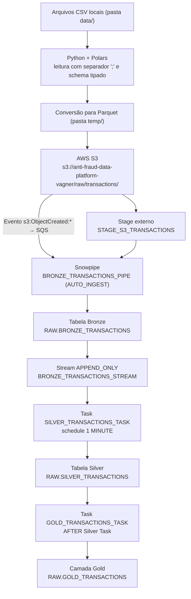

# Documentação Técnica — Pipeline de Dados Anti-Fraude

Repositório analisado: `michellvagner/anti-fraud-data-plataform`
Todas as informações abaixo foram extraídas diretamente dos arquivos Python, SQL e de configuração do projeto.

---

## 1. Objetivo do projeto

O projeto implementa um pipeline de dados de transações de cartão para um cenário de prevenção a fraudes. Os arquivos de transações são preparados localmente em Python, convertidos para Parquet, enviados para um bucket AWS S3 e ingeridos automaticamente no Snowflake, onde percorrem uma arquitetura em camadas (Bronze → Silver → Gold) com processamento incremental baseado em Stream e Tasks.

O objetivo do pipeline é disponibilizar, ao final do fluxo, uma tabela analítica agregada por banco e mês contendo volume, valor e taxa de aprovação das transações — insumos típicos de monitoramento de comportamento transacional e prevenção a fraudes.

---

## 2. Tecnologias utilizadas

| Camada | Tecnologia | Onde aparece no projeto |
|---|---|---|
| Preparação de dados | Python 3.11, Polars, PyArrow | `src/convert_transactions.py`, `pyproject.toml` |
| Envio/armazenamento | AWS S3 (boto3) | `src/upload_transactions.py`, `src/aws_s3.py` |
| Notificação de eventos | AWS SQS (fila gerenciada pelo Snowpipe) | `src/aws_s3.py`, `src/execute_sql.py` |
| Provisionamento | Terraform | `infrastructure/main.tf` |
| Data Warehouse / Pipeline | Snowflake (Stage, Snowpipe, Stream, Tasks) | `sql/0_*.sql` a `sql/9_*.sql` |
| Orquestração local | Python (`main.py`), Jinja2, snowflake-connector-python | `src/main.py`, `src/execute_sql.py` |
| CI | GitHub Actions + pytest | `.github/workflows/ci.yml` |

---

## 3. Arquitetura do pipeline



Fluxo resumido:

```
S3 → Stage → Snowpipe → Bronze → Stream → Task → Silver → Task → Gold
```

Observação: além do caminho principal, o projeto também envia os arquivos CSV originais para o prefixo `landing/transactions/` (`src/upload_transactions.py`), que funciona como área de aterrissagem do dado bruto e **não** é consumida pelo Snowpipe.

---

## 4. Preparação e conversão dos dados

Implementada em `src/convert_transactions.py`.

**Origem:** todos os arquivos `*.csv` da pasta local `data/` (`DATA_PATH.glob("*.csv")`). Essa pasta está no `.gitignore` e não faz parte do repositório.

**Leitura (Polars):**

```python
df = pl.read_csv(file_path,
                 separator=";",
                 schema_overrides={ ...12 colunas forçadas para pl.String... })
```

- Separador de campos: `;`
- `schema_overrides` força a leitura como texto (`pl.String`) de 12 colunas identificadoras/códigos: `TRANSACTION_ID`, `BANK`, `CARD_NUMBER`, `AUTHORIZATION_CODE`, `ACQUIRER_ID`, `CURRENCY_CD`, `TRANSACTION_COUNTRY_CD`, `MERCHANT_ID`, `REASON_CODE`, `POS_NUMBER`, `MERCHANT_CATEGORY_CODE`, `PROCESS_CODE`.
  Essa é a única conversão de tipos feita em Python: evita que códigos numéricos com zeros à esquerda (ex.: `REASON_CODE = '000'`, MCC, códigos de país) sejam inferidos como inteiros e percam a formatação original. As demais colunas mantêm a inferência automática do Polars.

**Tratamentos de qualidade em Python:** não foram identificados no código tratamentos de valores nulos, deduplicação, filtros ou descarte de registros inválidos. O único mecanismo de resiliência é o `try/except` por arquivo no laço de `process_transactions()`, que registra o erro e segue para o próximo arquivo — ou seja, um arquivo com falha é ignorado por completo, sem alteração do conteúdo dos arquivos válidos.

**Conversão para Parquet e envio:** para cada CSV, o DataFrame é gravado com `df.write_parquet(output_path)` em `temp/<mesmo_nome>.parquet`, enviado ao S3 via `boto3` (`upload_file`) com a chave `raw/transactions/<arquivo>.parquet` e o arquivo temporário é removido (`output_path.unlink()`). Ao final, a pasta `temp/` é apagada se estiver vazia.

**Por que Parquet:** formato colunar, comprimido e com esquema embutido (tipos das colunas viajam com o arquivo). Isso reduz o volume trafegado/armazenado no S3, dispensa a definição de um file format textual com delimitadores e permite ao Snowflake ler os campos diretamente por nome (`$1:COLUNA`) no `COPY INTO`, sem risco de erro de parsing de delimitador ou de inferência de tipo.

---

## 5. Quantidade de arquivos e registros processados

**Não foi possível identificar no projeto.** A pasta `data/` (origem dos CSVs) está listada no `.gitignore` e não existe no repositório — não há arquivos CSV nem Parquet versionados, em nenhum commit do histórico. Consequentemente:

- Quantidade de arquivos processados: **não identificada** (o código apenas imprime `len(csv_files)` em tempo de execução).
- Quantidade total de registros: **não identificada** (o código imprime `df.height` por arquivo em tempo de execução).
- Volume aproximado dos dados: **não identificado**.

**Formato original:** CSV delimitado por `;`.
**Formato final de armazenamento:** Parquet no S3 e tabelas nativas do Snowflake (Bronze, Silver e Gold).

---

## 6. Armazenamento dos arquivos no AWS S3

O bucket `anti-fraud-data-platform-vagner` (região `us-east-1`), criado via Terraform em `infrastructure/main.tf`, atua como data lake de entrada do pipeline. O Terraform cria o bucket e os prefixos `landing/`, `landing/transactions/`, `raw/` e `raw/transactions/`.

Papel de cada prefixo:

- `landing/transactions/` — cópia dos arquivos CSV originais, enviada por `src/upload_transactions.py`.
- `raw/transactions/` — arquivos Parquet convertidos; é este prefixo que alimenta o Snowflake.

Participação na ingestão: `src/aws_s3.py` configura uma *bucket notification* (`put_bucket_notification_configuration`) que publica os eventos `s3:ObjectCreated:*` do prefixo `raw/transactions/` na fila SQS do Snowpipe. O ARN dessa fila não é fixo: é obtido dinamicamente em `src/execute_sql.py` através de `SYSTEM$PIPE_STATUS('ANTI_FRAUD_DB.RAW.BRONZE_TRANSACTIONS_PIPE')`, lendo o campo `notificationChannelName`. Assim, cada novo Parquet gravado no S3 dispara automaticamente a carga na Bronze.

---

## 7. Pipeline de ingestão no Snowflake

Os objetos são criados pelos scripts numerados em `sql/`, executados em ordem por `src/execute_sql.py`.

| Script | Objeto criado |
|---|---|
| `0_create_db_schema.sql` | Database `ANTI_FRAUD_DB` e schema `RAW` |
| `1_stage_s3_transactions.sql` | Stage externo `RAW.STAGE_S3_TRANSACTIONS` |
| `2_create_bronze_transactions.sql` | Tabela `RAW.BRONZE_TRANSACTIONS` |
| `3_create_silver_transactions.sql` | Tabela `RAW.SILVER_TRANSACTIONS` |
| `4_create_stream.sql` | Stream `RAW.BRONZE_TRANSACTIONS_STREAM` |
| `5_create_pipe_bronze_transactions.sql` | Pipe `RAW.BRONZE_TRANSACTIONS_PIPE` |
| `6_create_task_silver_transactions_task.sql` | Task `RAW.SILVER_TRANSACTIONS_TASK` |
| `7_create_task_gold_transactions.sql` | Task `RAW.GOLD_TRANSACTIONS_TASK` |
| `8_resume_pipe_tasks.sql` | RESUME das Tasks e do Pipe |
| `9_suspend_pipe_tasks.sql` | SUSPEND das Tasks e do Pipe (parada do pipeline) |

**Database e Schema:** `ANTI_FRAUD_DB.RAW` concentra todos os objetos, incluindo as três camadas.

**Stage externo:** aponta para `s3://anti-fraud-data-platform-vagner/raw/transactions/` com `FILE_FORMAT = (TYPE = PARQUET)`. As credenciais (`AWS_KEY_ID`, `AWS_SECRET_KEY`, `AWS_TOKEN`) não estão no SQL: o arquivo é um template Jinja2 renderizado em tempo de execução por `execute_sql.py` com os valores lidos de `~/.aws/credentials` (`src/aws_credentials.py`).

**Snowpipe:** `BRONZE_TRANSACTIONS_PIPE` com `AUTO_INGEST = TRUE` executa um `COPY INTO ... FROM (SELECT $1:<coluna> ... FROM @STAGE_S3_TRANSACTIONS)`, mapeando explicitamente as 23 colunas do Parquet e acrescentando `METADATA$FILENAME` em `SOURCE_FILENAME`. Usa `ON_ERROR = 'CONTINUE'`, ou seja, arquivos com linhas problemáticas não abortam a carga.

**Ordem de execução na orquestração:** `setup_snowflake()` executa os scripts 0 a 5, obtém o ARN da fila SQS do pipe, configura a notificação no S3 e então executa os scripts 6 a 8 (Tasks e RESUME). A Task Gold é retomada antes da Task Silver, respeitando a regra do Snowflake de que uma task filha (`AFTER`) precisa estar ativa antes da raiz.

---

## 8. Camada Bronze

`RAW.BRONZE_TRANSACTIONS` recebe, sem transformação, o conteúdo dos arquivos Parquet do S3 carregados pelo Snowpipe.

Colunas de negócio (23):

- **Identificação da transação:** `TRANSACTION_ID`, `AUTHORIZATION_CODE`, `PROCESS_CODE`, `TRANSACTION_TYPE`, `REASON_CODE`, `TRN_DT`
- **Cartão / emissor:** `BANK`, `CARD_NUMBER`, `CARD_BRAND`, `CARD_LIMIT_TOTAL`, `CARD_LIMIT_REMAINING`
- **Valores:** `TRANSACTION_AMOUNT` (`NUMBER(18,2)`), `CURRENCY_CD`, `TRANSACTION_COUNTRY_CD`
- **Estabelecimento / adquirência:** `MERCHANT_ID`, `MERCHANT_NAME`, `MERCHANT_STATE`, `MERCHANT_CITY`, `MERCHANT_CATEGORY_CODE`, `POS_NUMBER`, `ACQUIRER_ID`
- **Antifraude:** `RISK_SCORE` (`NUMBER`), `BLOCK_IND`

Metadados de rastreabilidade:

- `SOURCE_FILENAME` — preenchido com `METADATA$FILENAME` do Snowpipe, isto é, o caminho/nome do arquivo Parquet de origem no stage. Permite rastrear qualquer registro até o arquivo que o originou (auditoria, reprocessamento e investigação de divergências).
- `INGESTION_TS` — `TIMESTAMP_LTZ DEFAULT CURRENT_TIMESTAMP()`, registra o momento da carga. Permite separar a data do evento de negócio (`TRN_DT`) da data de entrada no data warehouse, viabilizando controle de latência e recorte de cargas.

Ambos os campos são propagados até a Silver, preservando a linhagem do dado.

**Campo `TRN_DT`:** é armazenado como `VARCHAR` na Bronze, ou seja, a data/hora chega como texto exatamente no formato do arquivo de origem, sem cast na ingestão. Isso evita que registros com formato fora do padrão façam a carga falhar. A conversão é feita apenas na transição para a Silver (seção 10).

---

## 9. Processamento incremental com Stream e Tasks

**Stream (`sql/4_create_stream.sql`):**

```sql
CREATE OR REPLACE STREAM ANTI_FRAUD_DB.RAW.BRONZE_TRANSACTIONS_STREAM
    ON TABLE RAW.BRONZE_TRANSACTIONS
    APPEND_ONLY = TRUE;
```

O Stream funciona como um marcador de posição (offset) sobre a Bronze: ele expõe apenas as linhas inseridas desde a última leitura. Como o pipeline só faz inserts (Snowpipe), `APPEND_ONLY = TRUE` é suficiente e mais econômico. Quando o Stream é consumido dentro de uma transação DML (o `INSERT` da Task), seu offset avança automaticamente — garantindo que cada registro da Bronze seja processado uma única vez na Silver, sem necessidade de controle manual de datas ou de `MERGE` por chave.

**Tasks:**

- `SILVER_TRANSACTIONS_TASK` — task raiz, warehouse `lab_wh`, `SCHEDULE = '1 MINUTE'`, condicionada por `WHEN SYSTEM$STREAM_HAS_DATA(...)`. A cada minuto verifica se há dados novos no Stream; se não houver, a execução é dispensada e não há consumo de crédito do warehouse.
- `GOLD_TRANSACTIONS_TASK` — task filha, declarada com `AFTER RAW.SILVER_TRANSACTIONS_TASK`, formando um DAG simples: só executa após o sucesso da carga da Silver.

Resultado: após o `RESUME` (script 8), o pipeline opera de ponta a ponta sem intervenção — o upload de um novo Parquet no S3 dispara o Snowpipe, que alimenta a Bronze, que registra as novas linhas no Stream, que aciona a Task Silver, que encadeia a Task Gold. O script 9 suspende pipe e tasks para interromper o consumo.

---

## 10. Transformações realizadas da Bronze para Silver

Definidas em `sql/6_create_task_silver_transactions_task.sql`. A task executa um `INSERT INTO RAW.SILVER_TRANSACTIONS SELECT ... FROM RAW.BRONZE_TRANSACTIONS_STREAM`.

Transformações efetivamente presentes no código:

1. **Reordenação e seleção de colunas** — as 23 colunas de negócio mais `SOURCE_FILENAME` e `INGESTION_TS` são reorganizadas em ordem analítica (transação → cartão → valores → estabelecimento → antifraude → metadados). Nenhuma coluna é descartada.
2. **Conversão de `TRN_DT` de `VARCHAR` para `TIMESTAMP_NTZ`**:

```sql
TO_TIMESTAMP_NTZ(
    REGEXP_REPLACE(TRN_DT, '^(\\d{4}-\\d{2}-\\d{2}) (\\d{2})(\\d{2}):', '\\1 \\2:\\3:')
) AS TRN_DT
```

   O regex corrige o formato da hora na origem, em que os dígitos de hora e minuto vêm colados (padrão `AAAA-MM-DD HHMM:SS`). Os grupos capturados são a data (`\1`), a hora (`\2`) e o minuto (`\3`), reescritos como `AAAA-MM-DD HH:MM:SS`; em seguida `TO_TIMESTAMP_NTZ` faz o cast para timestamp sem fuso horário. Registros que já estiverem no formato padrão não são alterados pelo `REGEXP_REPLACE` (o padrão simplesmente não casa) e são convertidos diretamente.
3. **Conversão implícita de `INGESTION_TS`** — o campo é `TIMESTAMP_LTZ` na Bronze e `TIMESTAMP_NTZ` na Silver; o cast ocorre pela definição da tabela de destino, normalizando o metadado para um tipo sem fuso.

Transformações **não** implementadas (verificado no código): não há filtros (`WHERE`), deduplicação, tratamento de nulos, padronização de texto (trim/upper), validação de valores ou qualquer regra de negócio na etapa Bronze → Silver. A carga é integral e incremental, limitada ao conteúdo do Stream.

---

## 11. Camada Gold

Definida em `sql/7_create_task_gold_transactions.sql`. A task executa `CREATE OR REPLACE TABLE RAW.GOLD_TRANSACTIONS AS SELECT ... FROM RAW.SILVER_TRANSACTIONS`, isto é, a tabela é integralmente reconstruída a cada execução a partir de toda a Silver (recomputação total, não incremental).

**Objetivo:** entregar uma visão analítica agregada, pronta para consumo em relatórios e painéis de acompanhamento transacional.

**Granularidade:** `BANK` × mês (`TO_VARCHAR(TRN_DT, 'YYYY-MM') AS TRN_DT`), com `GROUP BY ALL` e ordenação por `BANK, TRN_DT`.

**Métricas calculadas:**

| Coluna | Regra |
|---|---|
| `QTY` | `COUNT(*)` — total de transações |
| `QTY_APPROVED` | contagem de transações com `TRANSACTION_TYPE = 'A'` e `REASON_CODE = '000'` |
| `APPROVED_RATE` | `DIV0(QTY_APPROVED, QTY)` — taxa de aprovação, com proteção contra divisão por zero |
| `TRANSACTION_AMOUNT` | `SUM(TRANSACTION_AMOUNT)` — valor total |
| `TRANSACTION_AMOUNT_APPROVED` | soma do valor apenas das transações aprovadas |
| `FATURAMENTO` | valor aprovado de `TRANSACTION_TYPE = 'A'` menos o valor de `TRANSACTION_TYPE = 'O'` (ambos com `REASON_CODE = '000'`) |
| `TICKET_MEDIO` | `ROUND(AVG(TRANSACTION_AMOUNT), 2)` |
| `TICKET_MEDIO_APPROVED` | `ROUND(AVG(CASE WHEN aprovada THEN TRANSACTION_AMOUNT ELSE 0 END), 2)` |

A regra de negócio única do projeto é a definição de transação aprovada: `TRANSACTION_TYPE = 'A'` combinado com `REASON_CODE = '000'`. `TRANSACTION_TYPE = 'O'` é tratado como contrapartida (dedução) no cálculo de `FATURAMENTO`.

---

## 12. Orquestração

`src/main.py` orquestra a execução local em quatro etapas:

1. `terraform apply -auto-approve` em `infrastructure/` — provisiona o bucket S3 e os prefixos.
2. `setup_snowflake()` — executa os scripts SQL 0–5, obtém o ARN da fila SQS do Snowpipe, configura a notificação de eventos no S3 e executa os scripts 6–8 (Tasks e RESUME).
3. `upload_transactions()` — envia os CSVs originais para `landing/transactions/`.
4. `process_transactions()` — converte os CSVs para Parquet e envia para `raw/transactions/`, disparando o restante do pipeline.

A partir daí, Snowpipe, Stream e Tasks executam automaticamente até a camada Gold. `src/destroy_infrastructure.py` faz o caminho inverso (`terraform destroy` + `DROP DATABASE`).

O Terraform é utilizado apenas como recurso de provisionamento da infraestrutura AWS (bucket e prefixos), sem participação na lógica do pipeline. A configuração da notificação S3 → SQS é feita em Python, pois depende do ARN gerado dinamicamente pelo Snowpipe.

---

## 13. Conclusão

O projeto entrega um pipeline funcional de ponta a ponta em arquitetura de medalhão dentro do Snowflake, com ingestão orientada a eventos (Snowpipe + notificação S3/SQS), processamento incremental via Stream `APPEND_ONLY` e automação por Tasks encadeadas. A separação de responsabilidades é clara: Python trata a preparação e a tipagem dos identificadores, o S3 atua como área de aterrissagem e gatilho da ingestão, a Bronze preserva o dado bruto com metadados de rastreabilidade, a Silver aplica a tipagem correta (com destaque para a normalização de `TRN_DT`) e a Gold consolida as métricas de negócio.

Pontos não identificados no projeto, registrados por transparência: os arquivos de dados de origem não estão versionados (`data/` no `.gitignore`), portanto não foi possível apurar quantidade de arquivos, total de registros nem volume processado; também não há, no código, tratamento de nulos, deduplicação ou filtros de qualidade em nenhuma das etapas.
